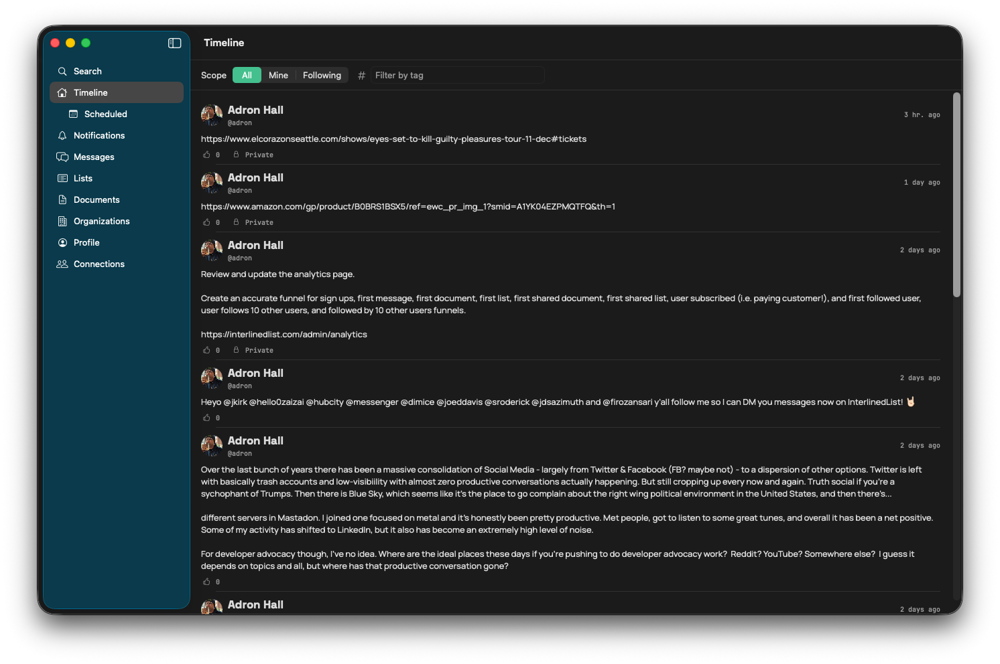
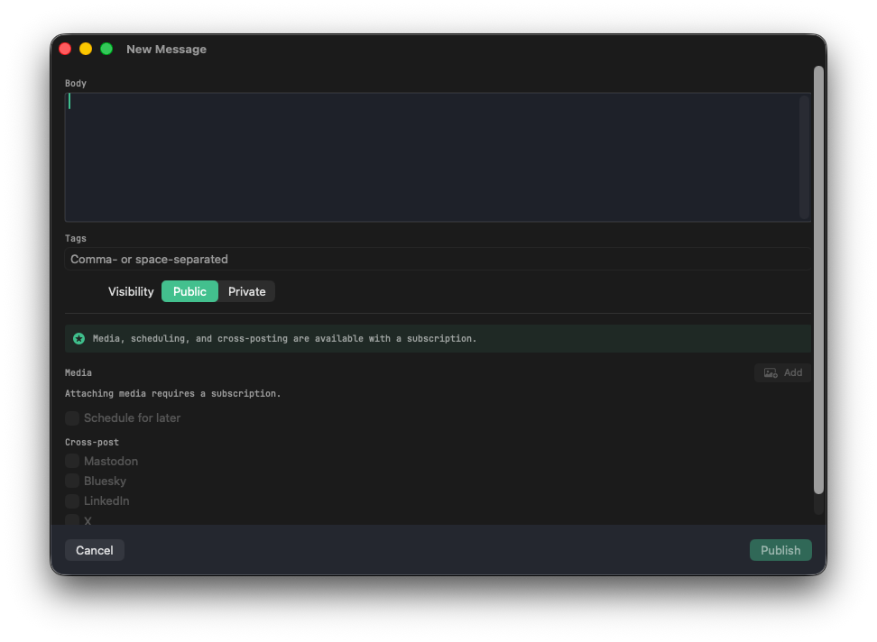
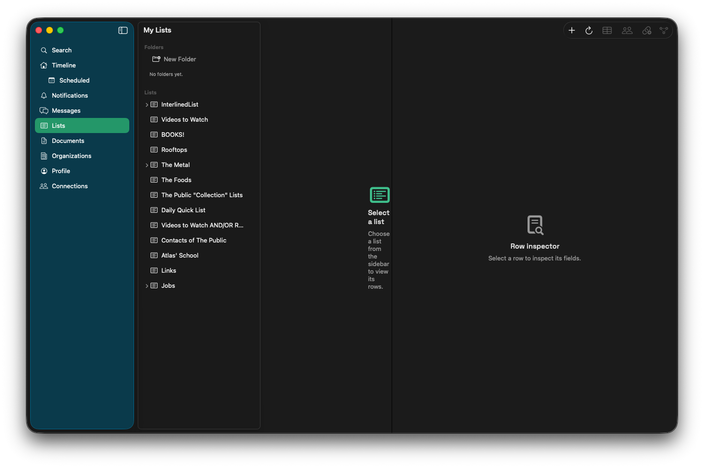
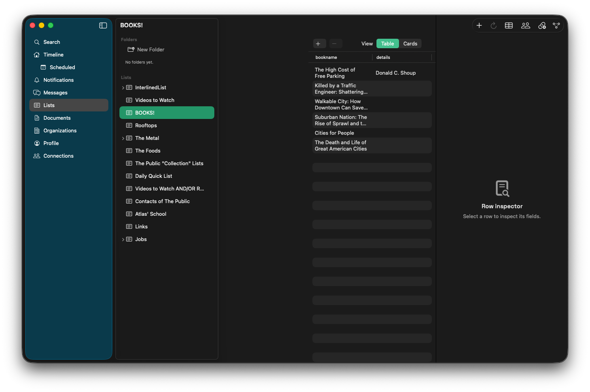
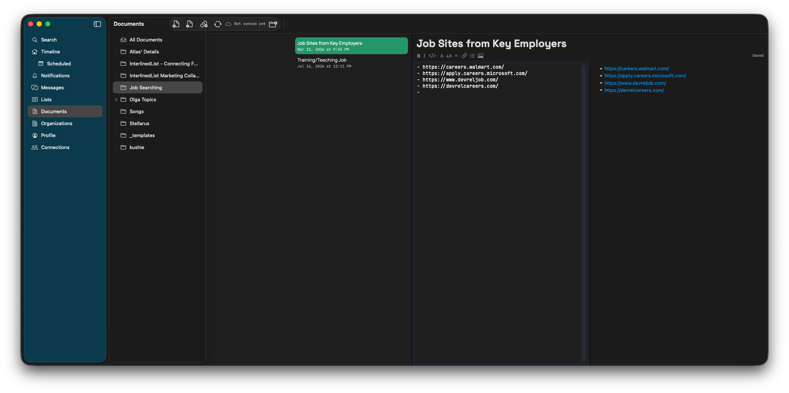
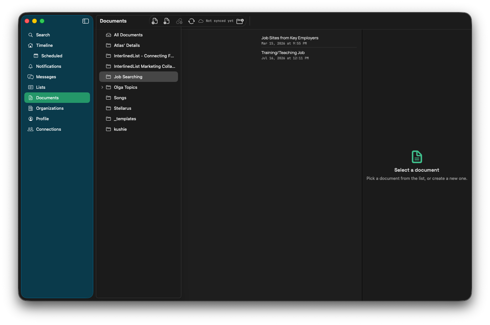
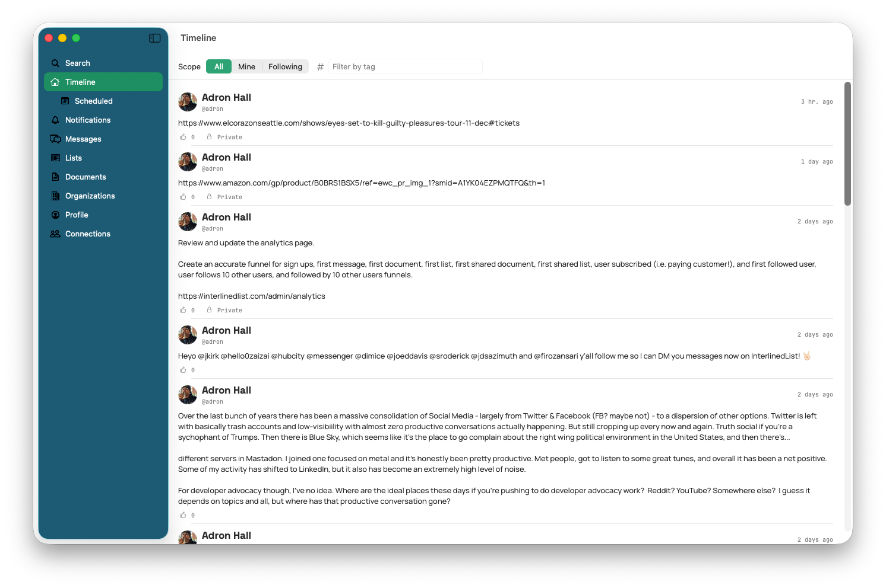

# Meet InterlinedList for macOS: Messages, Lists, and Documents in One Native Window

I've been spending time lately with a little app that scratches a very specific itch of mine: I want my messaging, my structured data, and my long-form notes to live in *one* place — and I want that place to feel like it actually belongs on my Mac. Not a browser tab pretending to be an app. Not an Electron window chewing through a gigabyte of RAM to render a text box. A real, native macOS app.

That app is **InterlinedList**, and it's the native macOS client for [interlinedlist.com](https://interlinedlist.com). It's built on Swift 6, SwiftUI, and SwiftData, it runs on macOS 15 (Sequoia) and up, and it mirrors what the web app can do while behaving like a first-class citizen of the platform — real windows, real keyboard shortcuts, a proper three-pane layout, and the whole thing wired into the documented InterlinedList API underneath.

Let me walk you through the three core pieces I reach for the most: **messages, lists, and documents**. Then I'll wrap up with a quick note on theming, because I know some of you are going to want that dark mode before you want anything else. (I see you. I *am* you.)


*The timeline — InterlinedList's home screen, here in dark mode.*

## Messages: a timeline that feels like home

The heart of InterlinedList is the **timeline**. It's the running feed of posts — Markdown-authored messages — and the app gives you the classic macOS sidebar → content → detail layout to move through it. Flip the scope between **All** (everybody's posts) and **Mine** (just yours), and drop a tag into the filter field when you want to narrow things down to a single topic.

Open any post and you get the full thread with its replies. From there the usual social gestures are all one click away:

- **Reply** to keep a conversation going.
- **I Dig!** — the app's reaction, with the running dig count right there.
- **Repost** to push something out to your own followers.
- **Edit** or **delete** your own messages when you inevitably spot the typo three seconds after posting.

The part I appreciate most is the **composer**. Hit **⌘N** and you get a *dedicated* composer window — its own window, not a cramped modal stapled to the timeline. Write your Markdown, add space- or comma-separated tags, and set the visibility to public or private with a toggle. If you're a subscriber, that same composer is where media attachments, scheduled posts, and cross-posting to Mastodon, Bluesky, LinkedIn, and X live — and the app pre-flights those cross-post targets before you publish, so you find out a platform isn't configured *before* you hit send, not after.


*The composer opens in its own window (⌘N): Markdown body, tags, visibility, and the subscriber cross-post toggles.*

It's a small thing, giving the composer its own window, but it's exactly the kind of native affordance that makes the app feel like it was built *for* the Mac rather than *ported* to it.

## Lists: structured data with an actual schema

This is the feature that sold me. **Lists** in InterlinedList aren't just bullet points — they're structured data with typed columns, closer to a lightweight database or a spreadsheet with opinions.


*My Lists — everything you own, ready to open.*

You define a list's shape with a compact schema, giving each column a type:

```
Title:text, Year:number, Available:boolean, Deadline:date,
URL:url, Contact:email, Priority:select(low|med|high), Notes:markdown
```

Text, number, boolean, date, URL, email, single-select from a set of options, and even full Markdown fields — they're all first-class. The **Schema Editor** lets you build and reorder those columns by drag-and-drop, and mark fields nullable when they're optional.

Once the shape is set, your rows render as a **real SwiftUI Table** — one properly typed column per field — or as key/value cards if you prefer that view. Add rows, edit them inline, inspect a single row in the detail pane, delete in bulk. Spin up a new list any time with **⇧⌘N**.


*A list rendered as a real table — one typed column per schema field, with a Row inspector on the right.*

And then it gets more interesting:

- **Share with watchers.** Invite someone by their `@handle` and hand them a role — Viewer, Editor, or Owner. The app looks the person up, shows you the match, and adds them. Change roles or remove watchers whenever you like.
- **Nest lists** into parent/child hierarchies right there in the sidebar.
- **Connections graph.** Lists can relate to other lists, and there's a visual graph to see how they hang together.
- **GitHub-backed lists.** Point a list at a GitHub source and refresh it from the toolbar to pull the latest rows.
- **Browse public lists** from other users, and save one to your own collection to start from its schema.

For anyone who's ever tried to bend a note-taking app into being a database, this is a breath of fresh air.

## Documents: Markdown with a folder tree and offline sync

The third pillar is **Documents** — a proper home for long-form Markdown, organized in a **folder tree** down the left side. Open a document and you get a side-by-side **editor and live preview**: raw Markdown on the left, rendered output on the right, updating as you type. The preview is pure SwiftUI rendering (via the Textual library), which is part of why the app asks for macOS 15+.


*Documents edit as Markdown on the left and render live on the right.*

A few touches I like:

- **Templates.** Start blank, or pick from **Meeting Notes**, **Daily Log**, or **PRD** starters. New blank doc is **⌥⌘N**; new from a template is **⇧⌥⌘N**.
- **Drag-and-drop images.** Drop a screenshot straight into the editor. If it's over the upload limit, the app resizes and re-compresses it client-side before sending — and if it *still* can't fit, you get a clear "image is too large" error instead of a silent failure.
- **Offline-capable sync.** Documents sync once on launch, and you can pull remote changes and push your local edits any time with **Sync Now** (**⌥⌘S**). Edited the same doc on two machines? The sync engine keeps the remote version as canonical and preserves your local edits as a separate copy with a banner, so nothing you wrote gets quietly clobbered.


*Documents live in a folder tree, with sync status right in the toolbar.*

Between the three, the pattern is consistent: the same sidebar → content → detail layout, the same native keyboard-driven feel, Markdown everywhere. You learn the app once and it pays off across every corner of it.

---

## Oh — and a quick note so you can change the theme as you desire, to either your system, light, or dark!

Because of course you want to. Here's how theming works in InterlinedList, and it's refreshingly simple.

InterlinedList doesn't lock you into one look, and it deliberately *doesn't* bolt on its own light/dark toggle for you to babysit. Instead, its entire color system is built from adaptive tokens — a warm, parchment-cream light palette and a deep, near-black dark palette (with that signature InterlinedList green and teal riding on top of both) — and the app tracks your **macOS system appearance** automatically. Change your Mac's look, and InterlinedList follows along instantly, no restart, no setting to hunt for.


*The same timeline in light mode. Flip your Mac's appearance and the app follows instantly — no in-app toggle required.*

So "setting the theme" for InterlinedList really means setting it for your Mac:

1. Open **System Settings** (the ⚙️ in your Dock, or Apple menu → **System Settings…**).
2. Click **Appearance** in the sidebar.
3. Pick your poison:
   - **Light** — the warm, paper-cream palette.
   - **Dark** — the deep, low-glare dark palette for late nights.
   - **Auto** — *your system's* call; it rides light during the day and shifts to dark in the evening on its own.

The moment you click, InterlinedList redraws in the new appearance — backgrounds, surfaces, text, links, the lot — because every color in the app is defined to adapt rather than sit at a fixed value. Set it and forget it, and the app just does the right thing wherever your Mac goes.

That's the tour. A native timeline, structured lists with a real schema, Markdown documents that sync, and a coat of paint that follows your system without you having to think about it. Give it a spin — and go make it dark. You know you want to.

Cheers,
Adron
